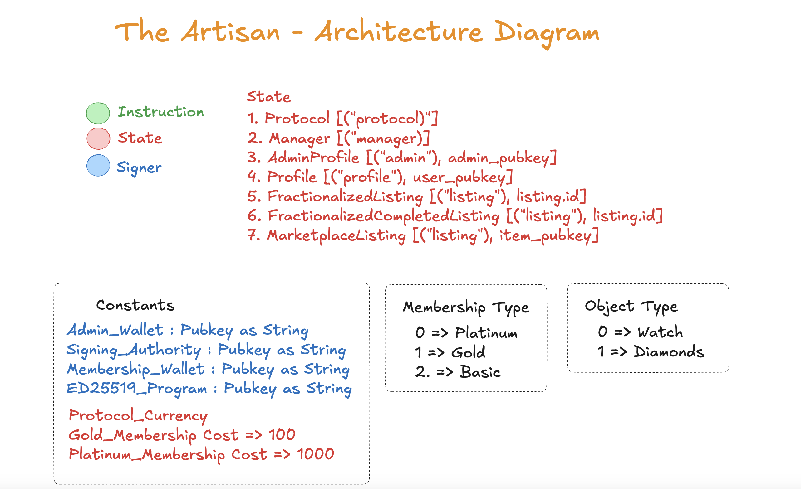
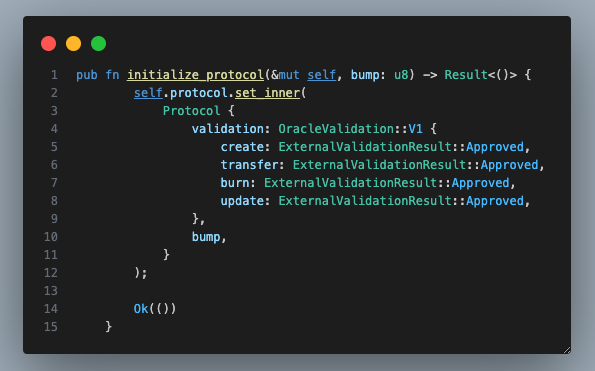
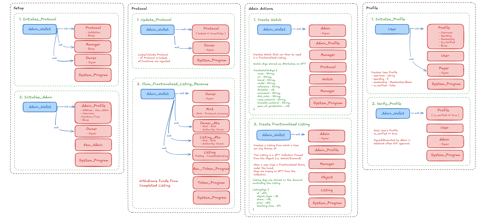
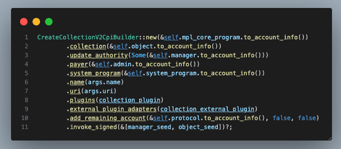
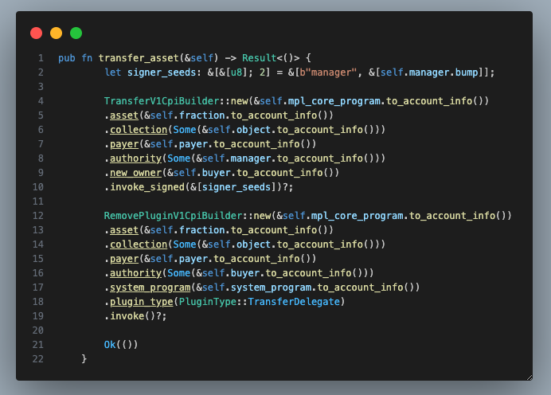

# The Artisan - Real World Assets on Solana

The Artisan is a RWA marketplace where users can buy fractionalized shares of luxury assets backed by Metaplex's Core NFT's. With our custom Solana Program, Artisan Protocol, we are able to ensure all regulatory compliances are met while providing access to Luxury Assets at an affordable price.

[Pitch Deck](https://docsend.com/view/jf8ghnmzucag9arf)

[Demo Video]()

## Table of Contents

- [Features](#features)
  - [Web3Auth](#web3auth)
  - [Stripe Pay](#stripe-pay)
- [Solana Program](#solana-program)
  - [Overview](#overview)
  - [Metaplex Core](#metaplex-core)
- [Team](#team)
- [License](#license)

## Features

- Custom Solana Program to facilitate minting and distribution of Metaplex Core NFTs

<video width="320" height="240" controls>
  <source src="./public/readme/buyflow.mp4" type="video/mp4">
  Your browser does not support the video tag.
</video>

- Custom off-chain Database to manage asset and user details necessary for compliance

<video width="320" height="240" controls>
  <source src="./public/readme/dashboard.mp4" type="video/mp4">
  Your browser does not support the video tag.
</video>

- Access Luxury Collections to purchase, trade, and sell fractions of available assets

<video width="320" height="240" controls>
  <source src="./public/readme/marketplace.mp4" type="video/mp4">
  Your browser does not support the video tag.
</video>

- Track your assets via an intuitive User Dashboard
- Refer friends to earn points and rewards

### Web3Auth

Use your Email as a wallet and pay using Stripe or Crypto. With Web3Auth integration, users can easily access their Artisan Profile from any browser and while securely maintaining their wallet. With this feature we aim to make the transition to The Artisan simple for Web 2 native investors.

<video width="320" height="240" controls>
  <source src="./public/readme/web3auth.mp4" type="video/mp4">
  Your browser does not support the video tag.
</video>

### Stripe Pay

Not familiar with crypto? No problem! Our custom Solana Program utilizes the `ED25519_PROGRAM_ID` to securely process a Stripe Checkout session to verify purchase and bypass the standard token transfer.

Under the hood our program checks for specific signers and messages to verify the transaction is legit and processed.

## Solana Program

## Program ID
| Cluster      | Program Id |
| :---        |    :----:   |
| **Localnet**     | `s8TwaQ8iKA4NPRgeSEGJfajD4hZAvriK5xisz82yBbU` |
| **Devnet**  | `s8TwaQ8iKA4NPRgeSEGJfajD4hZAvriK5xisz82yBbU` |
| **Mainnet**  | `coming soon`  |

Our Solana Program is currently deployed on Devnet and under testing within our community. Our aim is to launch on mainnet by 2025.

### Overview

The custom program uses a variation of accounts to faciliate all actions. With the `Protocol` account using Metaplex Core's `OracleValidation` we can secure the protocol with one function call, rendering it useless in the case of a breach.

The Artisan Protocal is strategically structured in a modular way to ensure proper functionality in a secure manner. By breaking down the actions into a scope based role, we are able to easily upgrade the program without requiring a total refactor.

With our Marketplace Listing functionality we are able to create an in-house marketplace for users to resell their fractions, allowing us to further use Metaplex Core for royalty collections and ensure buyers are adhering to all legal rules.

### Metaplex Core

With Metaplex Core we are able to dynamically create any Luxury Asset into a fractionalized RWA, and with plugins we can ensure KYC has been completed when user's approach the legal limit. When a user buys a fraction they are minting from the Object's Metaplex's verified collection, allowing us to not onlly resell on our in-house marketplace, but in 3rd parties such as Tensor and MagicEden.

## Team

- Renato Capizzi - CEO & Founder
- Leonardo Donatacci - CTO and Metaplex Community Dev
- Matt Weichel - Lead Developer

## License

See the [LICENSE.md](LICENSE.md) file for details.